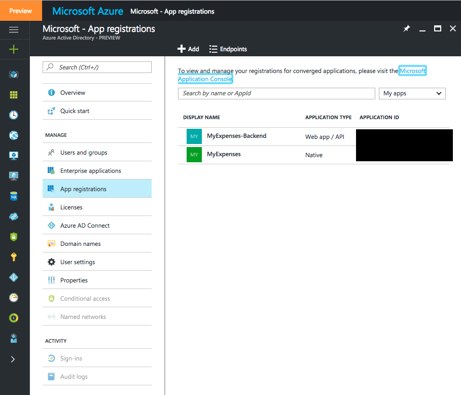
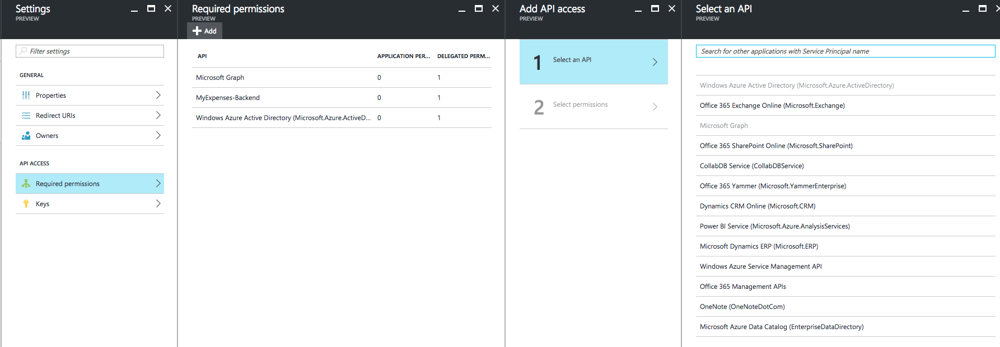
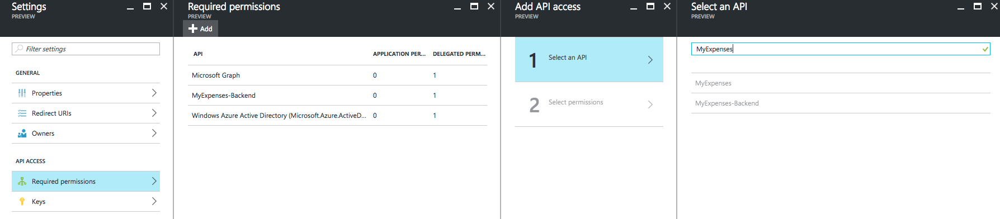
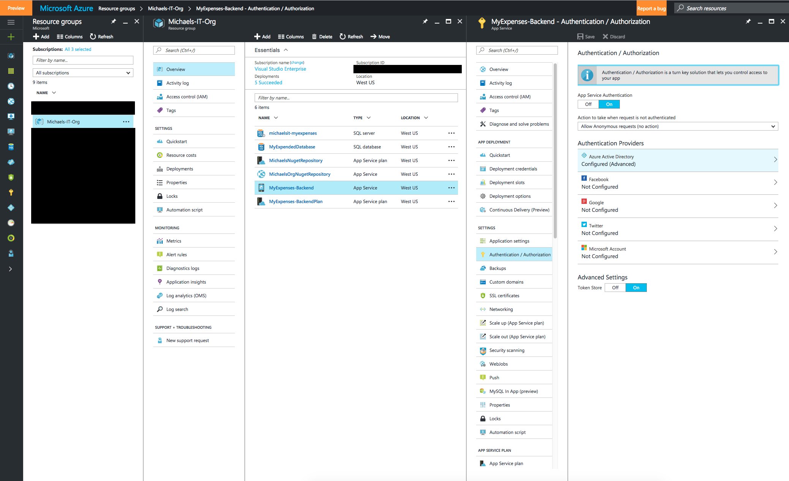
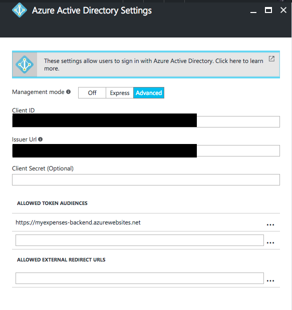

# MyExpenses with Azure Mobile App Backend

Created by Michael Watson  
Xamarin.Forms Ninja

This application is an example of a Xamarin.Forms mobile applicaiton connected to Azure Active Directory and utilizes an Azure Mobile App Backend.

### Additional Training Materials
* [Xamarin.Forms Book](https://developer.xamarin.com/guides/xamarin-forms/creating-mobile-apps-xamarin-forms/preview-2/)
    * This is the best place to start for Xamarin.Forms development
* [Develop Cloud Connected Mobile Apps with Xamarin and Microsoft Azure](https://adrianhall.github.io/develop-mobile-apps-with-csharp-and-azure/)
    * This is the best place to start out for Xamarin and Azure

### Installation Requirements
In order to run this example, you will need to have the following at a minimum:  

* Visual Studio Community Edition
    * Ensure you check the "C#/Xamarin" installation when running the universal [installer](https://www.visualstudio.com/downloads/)
* [Azure Trial Subscription](https://azure.microsoft.com/en-us/free/)

## Breaking down a mobile applicaiton

There are three basic components to every mobile applications:
1. Mobile Application 
2. Mobile Backend Service
3. Authorization/Authentication Service

We will cover all sections of this using Xamarin as our Mobile application and Azure as our backend services/Authorization Authentication service. 

### 1. Mobile applicaiton

Below I'm going to talk about why you should use technologies that deliver fully native applications in case you are still making considerations. If you have already gotten onboard the native mobile train, then skip ahead to where I discuss the architecture of this application. Otherwise, please read on.

The mobile applicaiton in today's world should be native. There are many arguements on what technology to use, but there should be no arguement between Hybrid and Native applications. Today's app store is flooded with similar solutions to what you are trying to create right now; typically there are at least 10 other applications currently available with similar capabilities. I can almost certainly gurantee that one of those competing applications is native. If you pick a hybrid solution, you won't stand a chance in my opinion. I'm not only saying this from a mobile developer stand point, but also from my own independent research. 

I have lived in San Francisco for the last seven years and have witnessed first-hand the mobile explosion we have seen. During this time I have constantly been talking to users about mobile applications, what they love, hate and refuse to tolerate. I have found that every person I have talked to has at least one applicaiton on their phone that they absolutely hate, but have to use. The most common example is banking applications and I can give a solid example of what I'm talking about.

I moved in with my girlfriend and we decided to open a joint bank account. When evaluating banks, being able to understand my transaction history and account balanced on the go was a must. I'm constantly traveling and have a tight hold on my finances, I need to make decisions at anytime. I looked at the big three banks in the United States in my evaluation: Bank of America, Wells Fargo and JP Morgan Chase. Wells Fargo was the first bank to fall in my evaluation simply because of their mobile application, it was a hybrid app. After using the application for a few minutes, I found myself frustrated when a button didn't visually indicate that I had pressed it, so I would press it again after waiting five seconds or so. This would of course prompt a dialog that something went wrong and I would have to just be patient. 

_Patience_......This is the problem you are facing with your mobile applicaiton. Users have tasted native experiences on their phone and love them. We all love our phones and they work perfectly for us. When an application runs poorly, the user instantly blames the applicaiton because they have seen the native applications perform brilliantly. Why should they keep using your application? Most will just delete and move to the next solution. Some of us have to use these applications and we just pray for something better to come along. Users patience is getting shorter as technology advances and expectations rise. Give your application a fighting chance in today's world by going native. I can gurantee you won't regret your decision going native, but is it worth the risk to try hyrbid? In my opinion, its not. I've worked with 100's (if not over 1000) of customers on switching from hybrid to native because hybrid didn't work well for them. Think about it like this, Apple and Android don't spend all their time trying to make the Javascript interpreter work better for hybrid applications. 

If you are wondering _Xamarin vs. Native_, Colby Williams (a colleague of mine) wrote a great blog that discusses [Xamarin vs. Native](http://www.colbylwilliams.com/2016/09/27/xamarin-vs-native.html) and he highlights why they should be your only choices. 

#### Mobile App Architecture
This mobile application was built with Xamarin.Forms. Only iOS and Android projects were included, but a [UWP application](https://developer.xamarin.com/guides/xamarin-forms/platform-features/windows/installation/universal/) could easily be added. 

The Xamarin.Forms applicaiton has the following projects in it:
* Portable Class Library (PCL or Pickle)
    * [Shared Projects](https://developer.xamarin.com/guides/cross-platform/application_fundamentals/shared_projects/) is another option to share your code. It really comes down to personal preference. 
    * If you want some strong opinions, check out these prominent Xamarin developers opinions:
        * [Jason Smith](http://xfcomplete.net/general/2016/01/19/pcl-or-shared-project/), Original Xamarin.Forms Author
        * [Miguel de Icaza](http://tirania.org/blog/archive/2016/Jan-22.html), Original Founder of Mono Project 
        * My Opinion should be obvious since I chose a PCL in this example. I agree with Jason Smith on this one but you can also use both projects in one solution
* iOS Project
* Android Project
* UITest Project
    * Every mobile project should have UI tests in it

Xamarin.Forms enables us to utilize the Xamarin.iOS and Xamarin.Android libraries to share not only out backend/services code, but also our UI code. Xamarin.Forms abstracts each control to the platform specific control being targetted. 

### 2. Azure Mobile App Backend
The backend for this mobile application utilizes both a TableController and StorageController in Azure Mobile App. 
* [TableController](https://docs.microsoft.com/en-us/azure/app-service-mobile/app-service-mobile-dotnet-backend-how-to-use-server-sdk#a-namedefine-table-controllera-how-to-define-a-table-controller)
    * This controller maps the ExpenseReport object to a database and creates api endpoints at /tables/ExpenseReport/ for us. 
    * Using this controller enables us to use [Offline Sync](https://docs.microsoft.com/en-us/azure/app-service-mobile/app-service-mobile-xamarin-forms-get-started-offline-data) in our project
* [StorageController](https://docs.microsoft.com/en-us/azure/app-service-mobile/app-service-mobile-xamarin-forms-blob-storage)
    * This controller is used for Blob Storage to save pictures of receipts to Expenses
    * Custom Http routes have been created for this

We are also able to use the Entity Framework (EF) to automatically map properties from our models. In this example, I use EF to [relate Expenses and ExpenseReports through their ID properties](https://github.com/michael-watson/Azure-MyExpenses/blob/master/MyExpenses.Backend/MyExpenses.Backend/Models/MobileServiceContext.cs#L47). This is done using the _Key_ and _ForeignKey_ in EF. 

You can deploy this backend to your own Azure Mobile App and hook it up to use Active Directory. 

### 3. Authorization/Authentication Service
Next we want to make sure that only the right people can access our services. Active Directory will authorize users by allowing them to login and accept the servers to authenticate. We will need to do this by setting up our services in our Azure portal. 

First we will need to create an app registration in our Active Directory. Navigate to [portal.azure.com](portal.azure.com) and access your active directory app registrations:

You can create a new app here, but we will need two things:
1. The native application that is our mobile application
2. The Web app that is our Azure Mobile App backend

We will next need to setup our permissions. Our backend will need to access Azure Active Directory and our Backend service. 

You may need to search for your backend service to find it and add the api access like below:

Make sure that you set the same permissions for our native application as well.

Next we will need to navigate to our Azure Mobile App service in the azure portal and select "Authentication / Authorization" in the Settings of the Azure Mobile App:

Here we can configure whatever service we want to use as our backend, in our case we are using Active Directory and can configure that. Express setting should work fine, but if you want to customize the ClientId or change login endpoints, you can easily by selecting "Advanced":  

 
Now we will want to use the ClientId values of our backend service and our native app in our mobile application. This code lives in the [AppViewModel](https://github.com/michael-watson/Azure-MyExpenses/blob/master/MyExpenses.Mobile/MyExpenses/ViewModels/AppViewModel.cs#L15). Now everything is wired up!

## License

MIT License

Copyright (c) 2016 Michael Watson

Permission is hereby granted, free of charge, to any person obtaining a copy of this software and associated documentation files (the "Software"), to deal in the Software without restriction, including without limitation the rights to use, copy, modify, merge, publish, distribute, sublicense, and/or sell copies of the Software, and to permit persons to whom the Software is furnished to do so, subject to the following conditions:

The above copyright notice and this permission notice shall be included in all copies or substantial portions of the Software.

THE SOFTWARE IS PROVIDED "AS IS", WITHOUT WARRANTY OF ANY KIND, EXPRESS OR IMPLIED, INCLUDING BUT NOT LIMITED TO THE WARRANTIES OF MERCHANTABILITY, FITNESS FOR A PARTICULAR PURPOSE AND NONINFRINGEMENT. IN NO EVENT SHALL THE AUTHORS OR COPYRIGHT HOLDERS BE LIABLE FOR ANY CLAIM, DAMAGES OR OTHER LIABILITY, WHETHER IN AN ACTION OF CONTRACT, TORT OR OTHERWISE, ARISING FROM, OUT OF OR IN CONNECTION WITH THE SOFTWARE OR THE USE OR OTHER DEALINGS IN THE SOFTWARE.